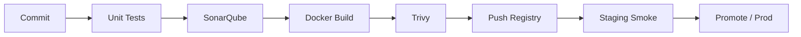

# Architecture

## Services

| Service | Role | Port |
|---------|------|------|
| API | REST ingress, enqueues orders | 8000 |
| Worker | Dequeues and marks orders processed | — |
| Redis | Queue + order state | 6379 |

## CI/CD flow

## Quality gates

1. **pytest** — API contract and Redis integration (fakeredis in tests)
2. **SonarQube** — static analysis on Python sources
3. **Trivy** — block HIGH/CRITICAL CVEs in images
4. **Smoke tests** — `/health` and order creation against deployed URL

## Artifact promotion

Jenkins shared library `promoteArtifact` wraps `scripts/jfrog-promote.sh` for moving images from `docker-local` to `docker-release` after staging validation.
